<!--DOCTYPE html-->
<html lang="pt-br">
<head>
  <meta charset="UTF-8">
  <meta name="viewport" content="width=device-width, initial-scale=1.0">
  <title>Mikasa mi Nzolu</title>
  
</head>
<body>
<!-- Cabeçalho -->
<header>
  <!-- Ícone menu hambúrguer à esquerda -->
  
&#9776;

  <!-- Logo central -->
  

  <!-- Ícone de pesquisa à direita -->
  
&#128269;

</header>
<!-- Menu de Navegação (abre da esquerda) -->
<nav id="nav-menu">
  <ul>
    <li class="menu-item" style="background-color: #002E8B;"><a href="#">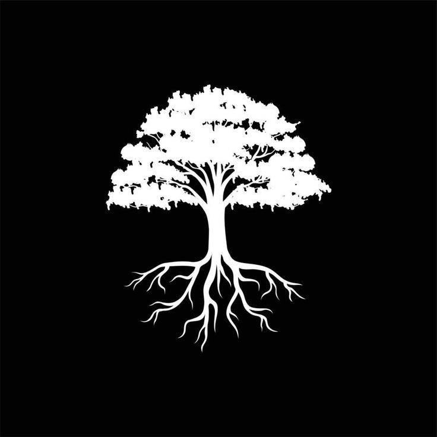Daniel Muti</a></li>
    <li class="menu-item" style="background-color: #2A3EA5;"><a href="#">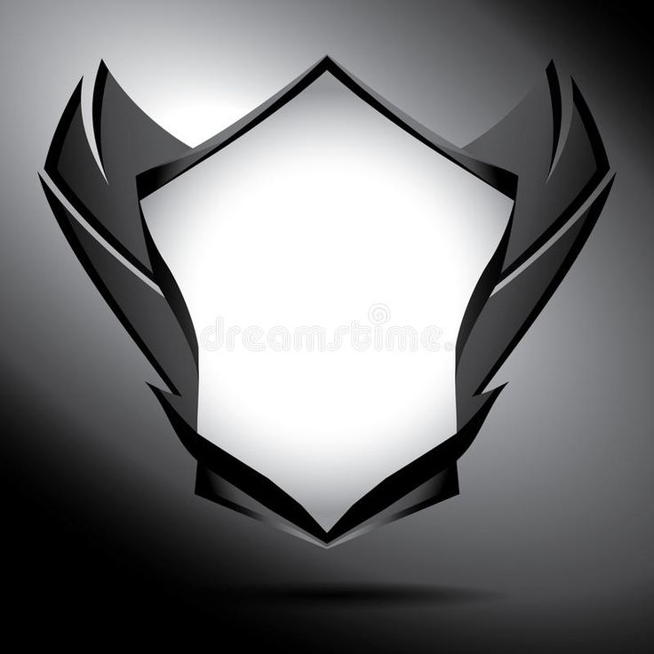David wa Nzimbo</a></li>
    <li class="menu-item" style="background-color: #2250B2;"><a href="#">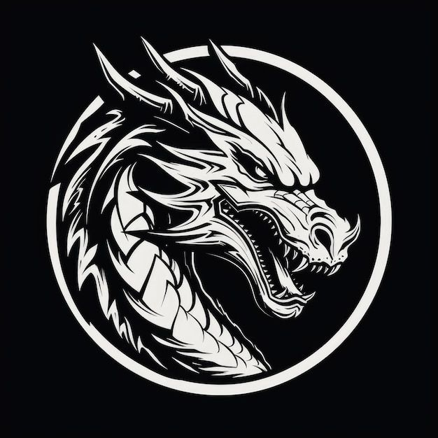Drogon</a></li>
    <li class="menu-item" style="background-color: #5C6ACD;"><a href="#">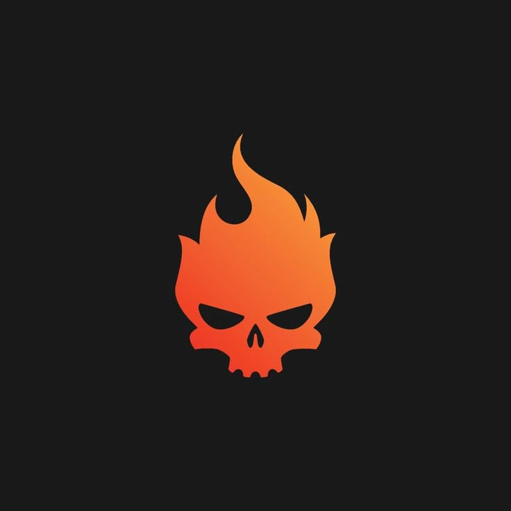Luzala Oluhe</a></li>
    <li class="menu-item" style="background-color: #1438DC;"><a href="#">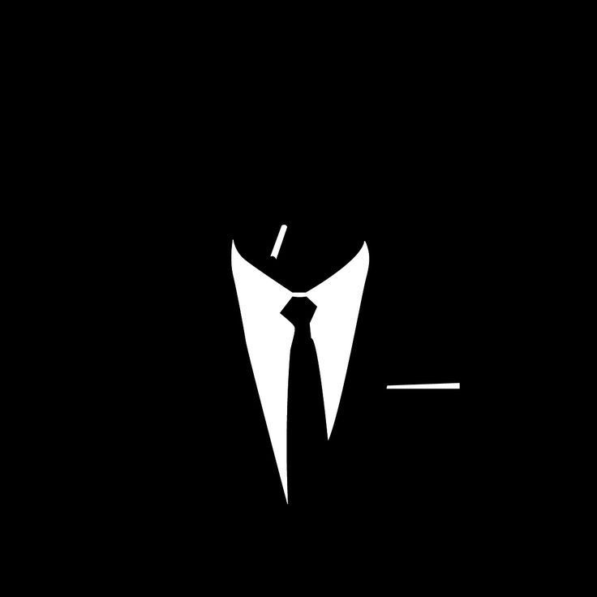Saul Kudihanga</a></li>
    <li class="menu-item" style="background-color: #478DFF;"><a href="#">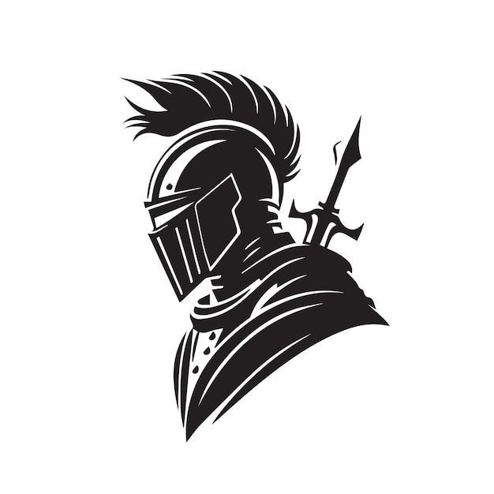Cavaleiro (Mário Nitu)</a></li>
  </ul>
</nav>
<!-- Conteúdo Principal -->
<main>
  <!-- 1ª Seção: Título da Página -->
  <section id="secao1" class="secao">
    <h1>Mikasa mi Nzolu</h1>
  </section>
  <!-- 2ª Seção: Subtítulo, Imagem e Texto Justificado -->
  <section id="secao2" class="secao secao-diferente">
    

      <h2>Mikasa mi Nzolu: Em Busca da Inocência Perdida</h2>
      

        <!-- Imagem de perfil com cantos arredondados -->
        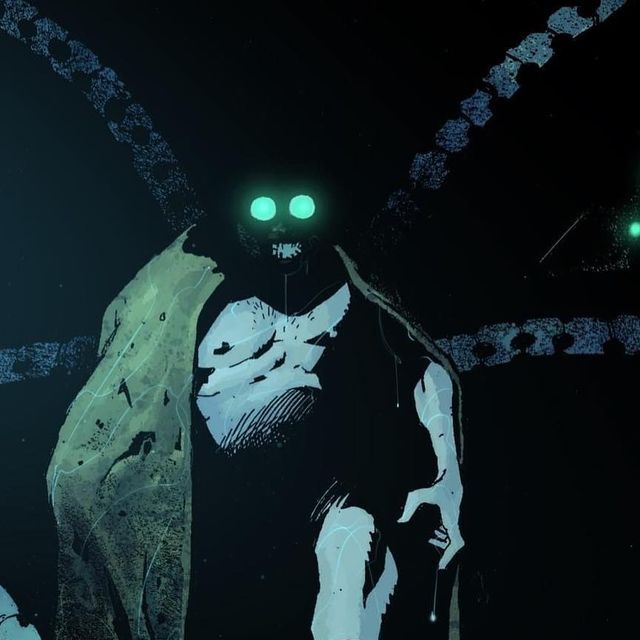
      

      
Xavier era apenas um menino quando sua vida foi arrancada pelo destino. O irmão caçula de Paulo e Massoche Nitu, teve sua infância interrompida por um acidente cruel. Desesperados para salvá-lo, seus irmãos embarcaram em uma jornada insana, em busca de qualquer meio que pudesse trazê-lo de volta.  Foi então que encontraram a <a href="https://zonflux070.github.io/Emu/">Emu</a>, a pedra mística de poder infinito. Mas o que era para ser um milagre se tornou uma maldição. Na tentativa de restaurar Xavier, aprisionaram sua consciência dentro da Emu, tornando-o um prisioneiro de sua própria mente.  O que veio depois foi uma sequência de tragédias. Na busca por corrigir seu erro, os irmãos deram origem às duas entidades que mudariam para sempre o destino de <a href="https://zonflux070.github.io/Telethra/">Telethra</a>: <a href="https://zonflux070.github.io/Z-nflux---Espectro/">Espectro</a> e <a href="#">X-Tron</a>.  Décadas se passaram. Xavier, esquecido no fluxo do tempo, foi finalmente encontrado—mas não pelos que o amavam. X-Tron, o tirano digital, encontrou a Emu e, com ela, o garoto que nunca cresceu. Mas X-Tron não via Xavier como uma criança perdida, e sim como uma peça valiosa em seu grande plano.  O que restava do menino foi remodelado, fundido ao metal frio e à lógica implacável das máquinas. Seu corpo, agora um arsenal de guerra. Sua mente, dilacerada entre o passado e o presente. Mikasa mi Nzolu nasceu das cinzas de Xavier, um mercenário cibernético moldado pela promessa de um retorno impossível.  X-Tron lhe fez um pacto cruel: ajude-me a construir a Unimente, una toda a humanidade sob minha consciência… e eu devolvo sua vida.  Mas seria Xavier realmente restaurado? Ou apenas mais uma ilusão em um jogo de marionetes?  Mikasa mi Nzolu luta com a esperança de recuperar sua inocência. Mas, no fundo, ele sabe… talvez sua alma tenha sido perdida para sempre.

    

  </section>
  <!-- 3ª Seção: 7 Links, Botão de Idioma e Link em Forma de Barra -->
  <section id="secao3" class="secao secao-diferente2">
    

      <a href="#">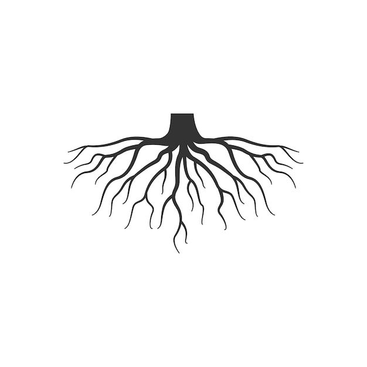<u>Helder Muti:</u> Eu era apenas um garoto sonhador, cujo maior desejo era me tornar um guerreiro Gorgor. Meu mundo girava em torno de batalhas imaginárias… até que a realidade me arrancou desse sonho. Quando um exército levou meu irmão, tudo mudou. Agora, ao lado da equipe de Espectro, não luto apenas por vingança—luto para salvar o Sistema Solar do caos.</a>
      <a href="#">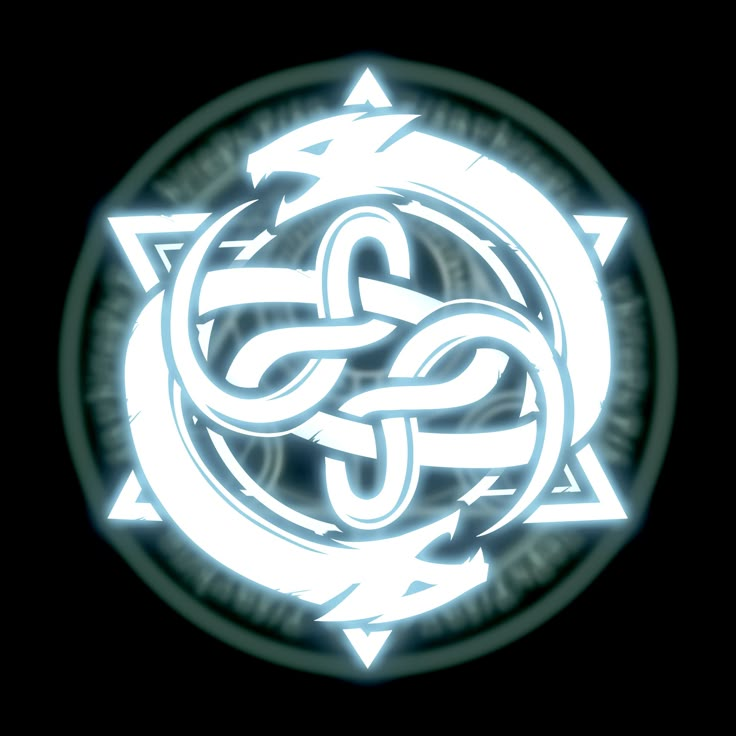<u>Salomão Nsuki:</u> Discípulo do Rei Missário, sou um cavaleiro banhado em luz e sombras. Minha fotocinese não é apenas um dom, mas um fardo que carrego para restaurar o equilíbrio do universo.</a>
      <a href="#">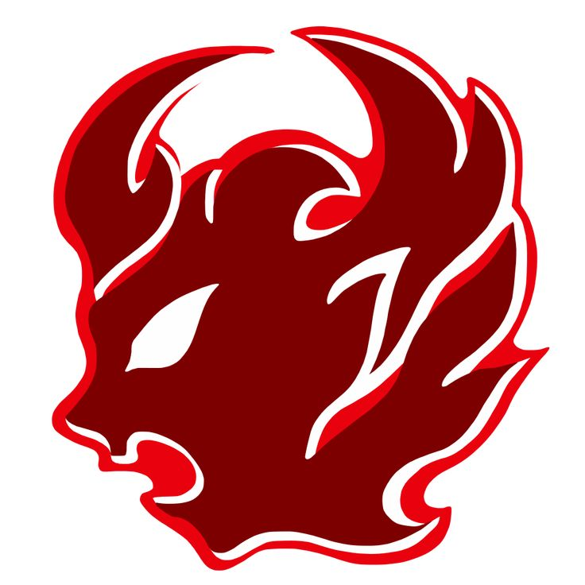<u>Suzana Mpanza:</u> Nascida Ermus, condenada ao destino da fúria. Desde os oito anos, quando um mercenário chamado Dragon destruiu minha família, a fera dentro de mim acordou. Agora, minha dor é minha força, e meu corpo pode se tornar um monstro colossal. Mas… será que minha humanidade ainda existe?</a>
      <a href="#">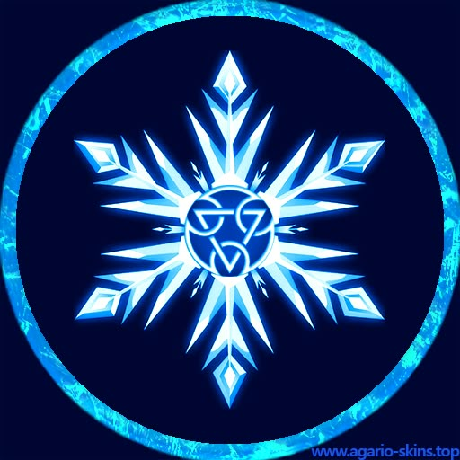<u>Cool:</u> Eu já fui um Kakan hidrocinético, mas a ciência me moldou em algo diferente. Agora, meu domínio sobre a água se transformou em uma habilidade ainda mais mortal—o poder do gelo. Fui modificado, recriado… mas ainda sou eu?</a>
      <a href="#">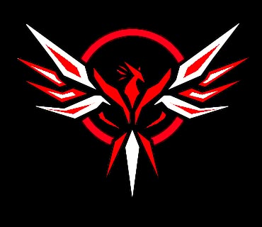<u>Paulo Kudihanga:</u> Sou um sargento Coriu e carrego uma promessa que jamais quebraria: salvar meu irmão da escuridão que o consome. Mesmo que para isso, eu tenha que enfrentar o próprio inferno.</a>
      <a href="#">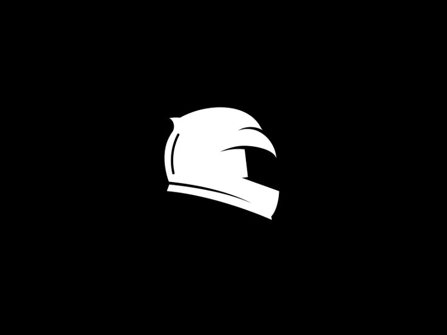<u>Motoqueiro (Elena Nitu):</u> Meu nome é Elena Nitu, mas nas ruas me chamam de Motoqueiro. Não sou apenas uma lenda sobre rodas, sou a chama que ilumina as trevas. Se o mundo precisa de um justiceiro, então que assim seja.</a>
    

    <!-- Botão para mudar o idioma -->
    <button id="btn-idioma" onclick="changeLanguage()">Mudar Idioma</button>
    <!-- Link em forma de barra sem margens com dois ícones -->
    

      <a href="https://zonflux070.github.io/Perfil-do-Espectro/">
        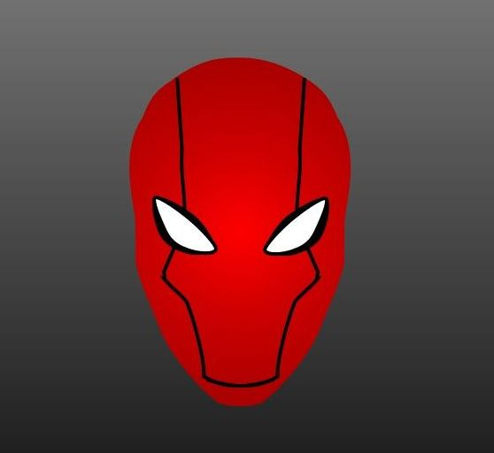
        Everso
        
        </a>
    

  </section>
</main>
<!-- Rodapé -->
<footer>
  <!-- Rodapé 1: Curiosidades -->
  

    <h3><u>O Chamado da Zônflux – Você Está Pronto?</u></h3> 
    
Em um universo onde a energia flui como uma força viva, moldando destinos e redefinindo a própria existência, a Zônflux não é apenas um poder… é um enigma. O que aconteceria se uma energia capaz de alterar a realidade caísse em mãos erradas? E se os heróis que deveriam proteger o equilíbrio começassem a questionar sua própria humanidade? Entre batalhas colossais e segredos enterrados pelo tempo, Espectro, X-tron e Everso não lutam apenas por Telethra, mas pela própria essência do que significa ser livre. Mas a verdadeira pergunta é: de que lado você estaria? A história está apenas começando… e você faz parte dela.

  

  <!-- Rodapé 2: Link Normal e Toggle de Modo Desktop/Móvel -->
  

    
A você, visitante, nosso mais sincero agradecimento por embarcar nesta jornada fascinante sobre Mikasa mi Nzolu. Sua curiosidade e dedicação nos motivam a continuar explorando os mistérios deste universo tão único. Esperamos que cada secção lida tenha despertado sua imaginação e lhe oferecido momentos de reflexão e inspiração.

    <a href="#">A Máscara Verde</a>
    <a href="#" id="toggle-mode" onclick="toggleMode()">Modo Desktop/Móvel</a>
    
© 2025 Universo Zônflux. Todos os direitos reservados.

  

</footer>

  
</body>
</html>
